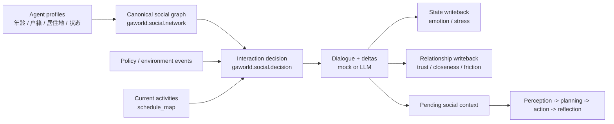
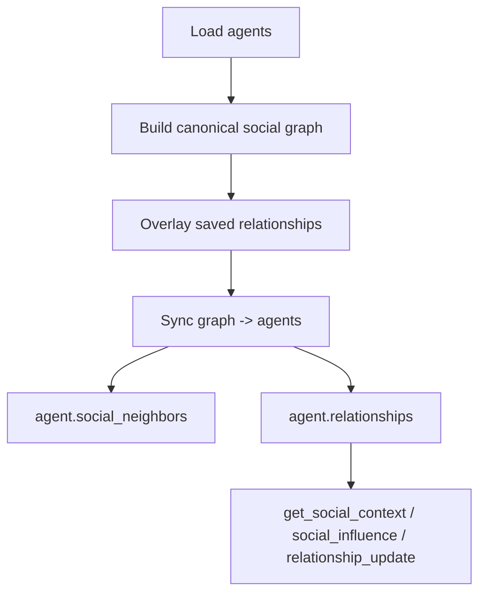
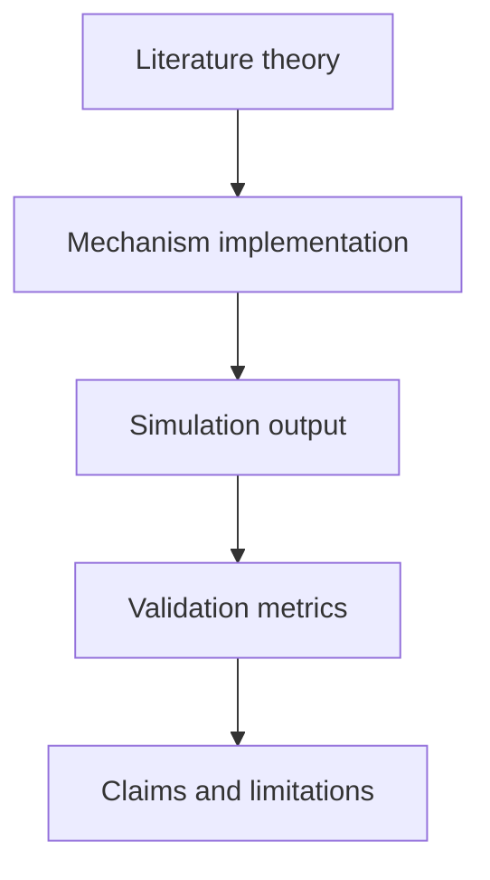
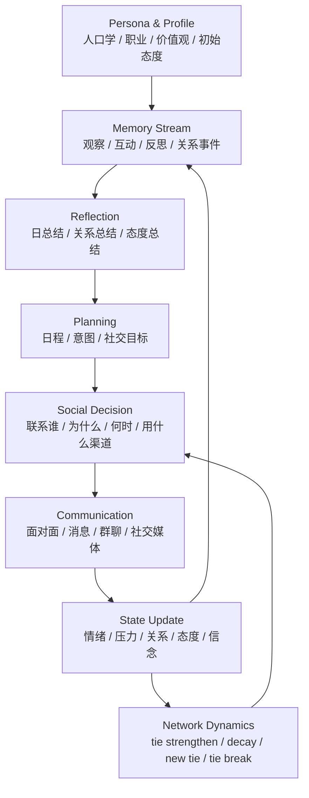
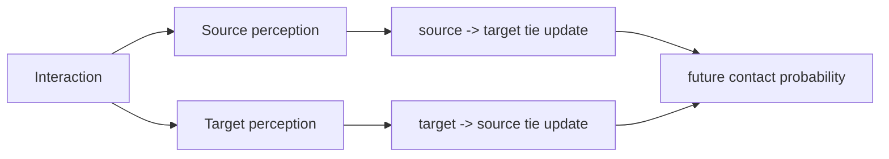
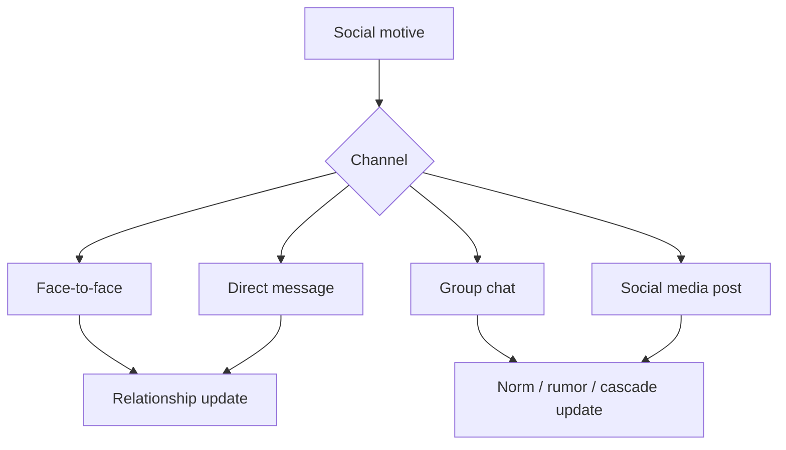
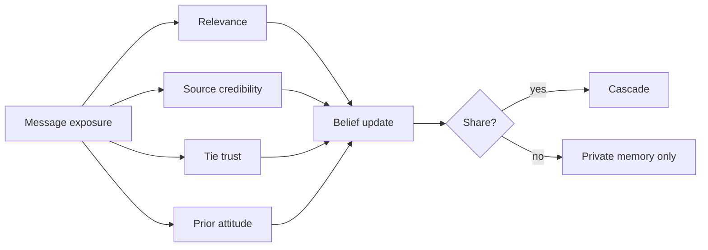

# GAWorld 社交系统

## 0. 结论

当前 GAWorld 社交系统已经能跑通一个基本闭环：建关系图、触发互动、生成聊天、更新情绪和关系、输出 timeline/dashboard。它适合作为工程原型，但还不是严格意义上的 LLM social simulation 研究系统。

## 1. 当前实现

当前系统位于 `gaworld/social/`，通过 `config.py` 的 extension hooks 接入主循环。



### 1.1 已具备的能力

- 加权社交图：每条边包含 `closeness`、`trust`、`obligation`、`friction`、`support`、`influence`、`weight`。
- 同质性建网：同片区、年龄相近、户籍相同、平台依赖/风险偏好接近的人更容易连边。
- 社交互动类型：`check_in`、`share_news`、`ask_help`、`invite`、`vent`、`conflict`。
- 消息扩散：`share_news` 可继续向高信任、高影响力、高易感性的邻居传播。
- 输出文件：
  - `output/social_interactions/events.jsonl`
  - `output/social_interactions/daily_summary.md`
  - `output/social_interactions/social_timeline.md`
  - `output/social_interactions/relationship_changes.csv`
  - `output/social_interactions/dashboard.html`

### 1.2 最近已修正的问题

之前主循环和新社交模块各自建社交网络，导致 `social_neighbors` 和 `relationships` 存在双来源。现在统一为：



核心入口：

- `gaworld.social.runtime.initialize_agent_social_state()`
- `gaworld.social.runtime.SocialInteractionRuntime`


| 文献/系统 | 对 GAWorld 的启发 | 当前是否实现 |
|---|---|---|
| Generative Agents / Smallville | memory stream、reflection、planning、agent 间日常互动 | 部分实现。GAWorld 有 memory/planning/action，但社交事件还没成为强记忆闭环 |
| Generative Agent Simulations of 1,000 People | 访谈 grounding、个体行为验证、与真实 survey 对齐 | 未实现。GAWorld 目前缺验证协议 |
| AgentSociety | 大规模城市社会仿真、needs/emotions/motivations、政策/灾害场景 | 部分接近。GAWorld 有城市、政策、经济、情绪，但社交层还不够系统 |
| S³ | 社交网络模拟、emotion/attitude/interaction behavior | 部分实现 emotion 和 interaction，缺 attitude/opinion state |
| OASIS / Y Social | 社交媒体式信息流、发帖/回复/转发、平台反馈 | 未充分实现。当前只有线下/泛社交互动和简单 share_news |
| SimBench / 1,000 People | 行为模拟 benchmark 和验证标准 | 未实现 |
| Validation critique papers | 明确边界、外部 grounding、robustness、避免过度 claim | 未实现为工程流程 |
| Classical ABM foundations | Schelling、bounded confidence、threshold cascade、diffusion baseline | 只有启发式影子，没有机制化 baseline |

### 2.1 当前系统的问题定位

当前社交系统可以被描述为：

> Heuristic social interaction layer with weighted ties and event-triggered dialogue.

但它还不能被描述为：

> Theory-grounded and validated LLM social simulation platform.

原因是它缺三层结构：




推荐的新设计不是推翻现有代码，而是在现有 `gaworld/social/` 上重构成六层。



### 3.1 Layer A：Agent Social State

新增明确的社会状态，而不是只靠 `state` 和 `relationships` 散落字段。

建议结构：

```python
social_state = {
    "attitudes": {
        "platform_policy": 0.0,
        "city_identity": 0.0,
        "labor_security": 0.0,
    },
    "beliefs": {
        "rumor_x_true": 0.5,
    },
    "norms": {
        "reply_obligation": 0.5,
        "help_neighbors": 0.5,
    },
    "communication_style": {
        "directness": 0.5,
        "empathy": 0.5,
        "public_voice": 0.5,
    },
}
```

对应文献脉络：

- S³：emotion、attitude、interaction behavior。
- Opinion dynamics papers：attitude/belief 随互动变化。
- Smallville：state 应被 memory/reflection/planning 使用。

### 3.2 Layer B：Memory Stream for Social Events

社交事件必须进入长期记忆，而不是只写 timeline。

新增事件类型：

- `social_observation`
- `social_interaction`
- `relationship_reflection`
- `rumor_exposure`
- `opinion_shift`

每条社交记忆至少包含：

```python
{
    "day": 1,
    "time": "13:00",
    "partner_id": 5,
    "channel": "face_to_face",
    "topic": "平台规则和近期收入压力",
    "summary": "王思远提醒我平台规则可能影响收入。",
    "valence": -0.2,
    "salience": 0.71,
    "relationship_delta": {"trust": 0.02, "friction": -0.01},
    "future_intent": "明天关注相关新闻，并可能问同事。"
}
```

Smallville 对齐点：

- observation 进入 memory stream。
- reflection 周期性总结。
- planning 使用 memory 和 reflection。

### 3.3 Layer C：Relationship Dynamics

当前关系更新基本是同步、线性、对称的。应改成有方向的 tie dynamics。



建议关系边改为有向或半有向结构：

```python
relationships[target_id] = {
    "closeness": 0.5,
    "trust": 0.5,
    "obligation": 0.5,
    "friction": 0.2,
    "support": 0.5,
    "influence": 0.5,
    "last_interaction_day": 1,
    "interaction_count": 3,
    "unresolved_tension": 0.1,
}
```

规则：

- 求助：求助者 trust 上升，被求助者 obligation/stress 可能上升。
- 倾诉：双方 closeness 上升，但 target fatigue 可能上升。
- 冲突：friction 上升，trust 下降，未来互动变少或转为 repair interaction。
- 分享新闻：source influence 上升，target belief/attitude 改变。

### 3.4 Layer D：Communication Channels

当前只有泛化“聊天”。建议拆渠道：

- `face_to_face`：同地点、吃饭、散步、社区互动。
- `direct_message`：异步消息，不一定立即回复。
- `group_chat`：多方扩散、norm pressure。
- `social_media`：发帖、评论、转发、平台反馈。



OASIS / Y Social 对齐点：

- 社交媒体不应只是“阅读新闻”，而应有 feed、post、reply、reshare、exposure。
- 信息传播应记录路径和变形。

### 3.5 Layer E：Diffusion and Opinion Dynamics

当前 `share_news` 只做简单转发。建议升级为两类机制并行：

1. LLM-based interpretation：agent 根据 persona 和 memory 解释消息。
2. Mechanistic baseline：bounded confidence / threshold cascade / DeGroot-style averaging。

这样可以避免纯 LLM 黑箱，也方便做消融实验。



### 3.6 Layer F：Validation and Metrics

新增指标不只是为了画图，而是为了回答“这个模拟可信到什么程度”。

建议输出：

- network metrics：density、average degree、clustering coefficient、centrality、isolated nodes。
- interaction metrics：daily interactions、channel distribution、conflict/help/invite ratio。
- tie dynamics：trust distribution、friction distribution、tie churn、new ties、broken ties。
- diffusion metrics：cascade size、depth、topic reach、time-to-peak。
- opinion metrics：mean attitude、polarization、variance、cluster separation。
- validation metrics：seed robustness、counterfactual diff、human/real data alignment。

## 4. 新模块结构建议

建议把 `gaworld/social/` 改成下面结构：

```text
gaworld/social/
  schemas.py              # typed records: nodes, ties, events, attitudes
  network.py              # homophily / weak ties / dynamic tie formation
  memory.py               # social memory stream and retrieval
  reflection.py           # relationship and attitude reflection
  planning.py             # social intentions and contact plans
  decision.py             # pair/channel/topic decision
  communication.py        # mock/LLM dialogue, DM, group chat, social post
  diffusion.py            # cascade, rumor, opinion update
  runtime.py              # hook-facing orchestration
  analytics.py            # metrics, dashboard, validation report
  hooks.py                # integration with generative_city_sim.py
```

旧文件可以渐进迁移，不需要一次性大改。

## 5. 近期路线图

### M1：文献对齐和边界声明

目标：让系统知道自己在模拟什么、不模拟什么。

- 新增 `docs/SOCIAL_LITERATURE_ALIGNMENT.md`。
- 从 awesome list 中选 8-12 篇核心文献做机制表。
- 在 report 中标注每个机制的来源：`heuristic`、`paper-inspired`、`validated target`。
- 写清楚当前 GAWorld 的 claim boundary：只能做探索性仿真，不能直接预测真实社会。

### M2：Smallville 式社交记忆闭环

目标：让 agent 真的记得社交经历。

- 将高显著性社交事件写入 memory/vector db。
- 增加 relationship reflection：每天总结“我和谁关系变好了/变差了/欠了谁人情”。
- `get_social_context()` 从最近社交记忆和关系 summary 中抽取，而不是只采样邻居。
- `planning` 里加入 social intention：今天要联系谁、避免谁、回复谁。

### M3：改造聊天生成

目标：解决 timeline 里聊天重复的问题。

- 默认 mock 增加多模板和 persona-sensitive variation。
- LLM 模式使用完整 prompt：persona、双方关系、最近记忆、当前活动、渠道、话题、期望情绪变化。
- 对话输出拆为 `surface_text` 和 `semantic_effect`，避免把好看的话术误当成真实机制。

### M4：有向关系和非对称更新

目标：让关系变化更符合现实。

- 将关系更新拆成 source->target 和 target->source。
- 加入 `interaction_count`、`last_topic`、`unresolved_tension`、`repair_need`。
- 不同互动类型使用不同非对称规则。

### M5：社交媒体和群体扩散

目标：对齐 OASIS / Y Social / S³ 方向。

- 新增 direct message、group chat、social media post。
- 记录 exposure graph。
- 追踪 rumor/news/opinion 的传播路径和变形。
- 引入 bounded confidence 或 threshold cascade baseline。

### M6：验证和实验报告

目标：让输出能支撑研究汇报。

- 新增 `output/social_interactions/metrics.json`。
- 新增 `output/social_interactions/validation_report.md`。
- 支持多 seed 重复实验。
- 支持 event vs no-event counterfactual social diff。
- 输出可复现 manifest：config、seed、LLM model、agent ids、run id。

## 6. 下一步最小可执行任务

建议不要立刻“大重构”。下一步先做四个小闭环：

1. **写文献对齐文档**
   - 文件：`docs/SOCIAL_LITERATURE_ALIGNMENT.md`
   - 内容：Smallville、1,000 People、AgentSociety、S³、OASIS、Y Social、SimBench、validation critique。

2. **社交记忆入库**
   - 文件：`gaworld/social/memory.py`
   - hook：`on_time_tick` 或 `on_agent_post_step`
   - 目标：conflict/help/invite/share_news 写入长期 memory。

3. **多样化 mock 聊天**
   - 文件：`gaworld/social/llm_events.py`
   - 目标：默认 timeline 不再像复制粘贴。

4. **社交指标输出**
   - 文件：`gaworld/social/analytics.py`
   - 输出：`metrics.json` 和 report 表格。

## 7. 验证现状

最近一次相关测试结果：

```text
python -m pytest tests/test_social_system.py -q
6 passed

python -m pytest tests/test_social_system.py tests/test_relationship_weighted_social_context.py tests/test_dynamic_behavior.py -q
63 passed

python -m pytest tests -q --ignore=tests/test_e2e_smoke.py
291 passed
```

`ruff` 当前环境未安装，因此未运行。

## 8. 判断标准

社交系统下一阶段是否成功，不看“聊天多不多”，而看：

- agent 是否会基于过去社交记忆改变未来互动。
- 信息是否沿着网络形成可解释的传播路径。
- 关系是否有方向性、历史性和修复机制。
- 输出指标是否能解释政策/事件对社会网络的影响。
- 系统是否能明确说明哪些结论可信，哪些只是探索性生成。
