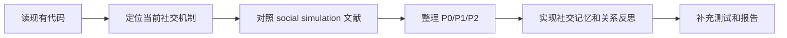
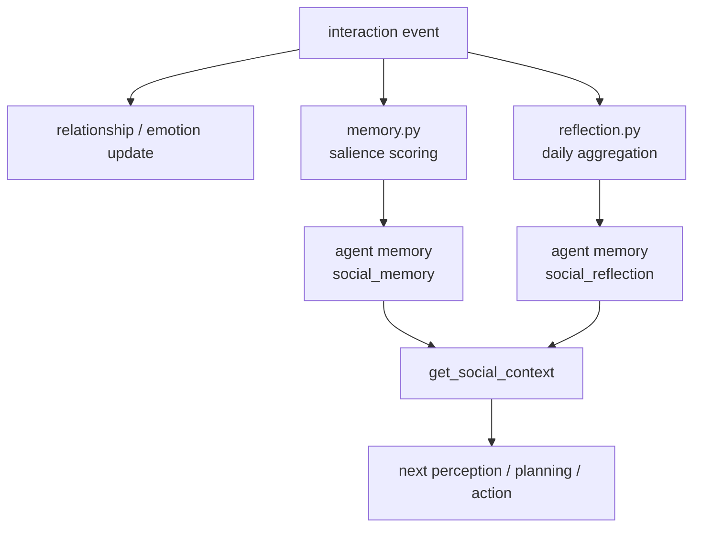

# GAWorld 社交模拟系统周报

## 1. 本周任务

本周围绕 GAWorld 的社交模拟系统做了三类工作：先梳理现有代码到底在做什么，再参考 LLM social simulation 相关论文重新定位系统边界，最后把 P0/P1/P2 的工程闭环落到代码和文档中。

具体任务包括：

- 梳理当前社交系统的运行方式：建关系图、触发互动、生成对话、更新情绪和关系、输出 timeline/dashboard。
- 分析 `timeline.md` 中聊天重复的原因：默认 mock dialogue 模板较固定，且社交事件没有充分使用 persona、关系记忆和历史上下文。
- 对照 Smallville / Generative Agents、AgentSociety、S³、OASIS、Y Social、SimBench 等方向，重新设计 GAWorld 社交系统的下一阶段框架。
- 完善 `docs/SOCIAL_SYSTEM_REPORT.md`，把当前实现、论文对齐、系统缺口和路线图整理成可汇报文档。
- 实现社交记忆和每日关系反思，让社交互动不只停留在输出文件里，而是回到 agent 的后续上下文中。

## 2. 本周完成情况

### 2.1 当前系统梳理

当前 GAWorld 社交系统已经是一个可运行的启发式社交互动层，主要能力是：

- 根据 agent 的年龄、居住地、户籍、平台依赖、风险偏好等特征建立加权社交网络。
- 在每个时间片根据关系强度、当前活动、环境事件和社交动机决定谁和谁互动。
- 支持 `check_in`、`share_news`、`ask_help`、`invite`、`vent`、`conflict` 六类互动。
- 每次互动会生成 message/reply，并更新双方情绪、压力、信任、亲近度、摩擦。
- 输出 `events.jsonl`、`daily_summary.md`、`social_timeline.md`、`relationship_changes.csv`、`dashboard.html`。

### 2.2 P0/P1/P2 工程修正

本周已经完成的优先级工作：

| 优先级 | 问题 | 已完成改动 |
|---|---|---|
| P0 | 社交网络存在双来源，主循环和新模块可能不一致 | 统一为 canonical social graph，并同步回 `agent.social_neighbors` 和 `agent.relationships` |
| P1 | 社交互动只写 timeline，没有进入 agent 后续记忆 | 新增 `gaworld/social/memory.py`，高显著性互动写入 memory 和 vector db |
| P1 | 每天结束后没有关系层面的总结 | 新增 `gaworld/social/reflection.py`，每天生成 relationship reflection |
| P2 | 后续行动的社交上下文太弱 | `get_social_context()` 现在会读取近期社交记忆和每日关系反思 |
| P2 | 报告缺少论文视角和路线图 | 完善 `docs/SOCIAL_SYSTEM_REPORT.md`，加入文献对齐、六层重设计和下一步计划 |

### 2.3 新增代码模块

新增文件：

- `gaworld/social/memory.py`
  - 根据互动类型、情绪变化、压力变化、信任变化、摩擦变化计算 salience。
  - 将重要社交互动写成 agent 主观记忆。
  - 写入 agent memory、vector db、agent log，并缓存最近社交记忆。

- `gaworld/social/reflection.py`
  - 每天按 partner 聚合互动次数、信任变化、亲近度变化、摩擦变化。
  - 生成 daily relationship reflection。
  - 写入 agent memory、vector db、agent log，并作为下一天 social context 的输入。

修改文件：

- `gaworld/social/hooks.py`
  - `on_time_tick` 后写入社交记忆。
  - `on_day_end` 后写入每日关系反思。

- `generative_city_sim.py`
  - `get_social_context()` 增加近期社交记忆和关系反思。

- `config.py`
  - 新增 `memory_salience_threshold = 0.50`。

- `tests/test_social_system.py`
  - 增加社交记忆持久化测试。
  - 增加每日关系反思持久化测试。

## 3. 当前判断

目前这个社交系统仍然不是完整的论文级 social simulation platform，但已经从“简单互动展示”推进到“互动会改变关系，并进入后续上下文”的阶段。

更准确的定位是：

> A paper-inspired social interaction layer with weighted ties, event-triggered dialogue, persistent social memories, and daily relationship reflection.

还不能过度声明为：

> A validated theory-grounded LLM social simulation system.

主要原因是：还缺显式 attitude/opinion state、社交意图规划、渠道模型、扩散 baseline、多 seed 验证和外部数据对齐。

## 4. 困难点

- 文献中的系统目标比当前代码更大。Smallville 强调 memory-reflection-planning 闭环，OASIS/Y Social 强调社交媒体传播，S³ 强调态度和互动行为，AgentSociety 强调大规模城市机制。GAWorld 当前只能先做其中一部分。
- 当前聊天重复不是单一 bug，而是 mock dialogue、prompt 信息量、历史记忆接入不足共同导致的。只改一句模板不能根本解决。
- 现有主模拟文件较大，社交逻辑需要逐步迁移到 `gaworld/social/`，否则继续在主文件里加功能会越来越难维护。
- 真实验证还没开始。目前可以证明系统能跑、状态会变、输出可读，但还不能证明模拟结果和真实社会行为一致。

## 5. 下周计划

下周建议按这个顺序做：

1. **多样化聊天生成**
   - 修改 `gaworld/social/llm_events.py`。
   - mock 模式加入多模板和 persona-sensitive variation。
   - LLM 模式 prompt 加入 persona、关系、近期社交记忆、当前活动、渠道和话题。
   - 目标：解决 `timeline.md` 中对话像复制粘贴的问题。

2. **社交意图规划**
   - 新增 `gaworld/social/planning.py`。
   - 基于每日关系反思生成 next-day social intentions。
   - 例如：联系谁、感谢谁、避免谁、修复谁、是否继续传播某条消息。

3. **有向关系更新**
   - 把当前关系变化进一步拆成 source -> target 和 target -> source。
   - 增加 `last_interaction_day`、`interaction_count`、`unresolved_tension`、`repair_need`。
   - 目标：让关系变化更像真实社交，而不是完全对称更新。

4. **社交指标输出**
   - 新增 `gaworld/social/analytics.py`。
   - 输出 network metrics、interaction metrics、tie dynamics、diffusion metrics。
   - 目标：汇报时不只展示聊天文本，还能展示社交结构如何变化。

5. **文献对齐文档**
   - 新增 `docs/SOCIAL_LITERATURE_ALIGNMENT.md`。
   - 从 awesome-llm-social-simulation 中选核心论文，整理“论文机制 -> GAWorld 已实现 -> GAWorld 待实现”。

## 6. 下周预期产出

- `timeline.md` 中对话重复显著减少。
- agent 的下一天行为能受到前一天社交记忆和关系反思影响。
- 输出一份 `metrics.json` 或 `validation_report.md`，用于展示社交网络和关系变化。
- 把系统定位从“简单互动层”继续推进到“Smallville-style memory-reflection-planning 社交闭环原型”。
